---
## Front matter
title: "Отчёта по лабораторной работе №2"
subtitle: "Дисциплина: архитектура компьютера"
author: "Рахматова Жылдыз Талантбековна"

## Generic otions
lang: ru-RU
toc-title: "Содержание"

## Bibliography
bibliography: bib/cite.bib
csl: pandoc/csl/gost-r-7-0-5-2008-numeric.csl

## Pdf output format
toc: true # Table of contents
toc-depth: 2
lof: true # List of figures
lot: true # List of tables
fontsize: 12pt
linestretch: 1.5
papersize: a4
documentclass: scrreprt
## I18n polyglossia
polyglossia-lang:
  name: russian
  options:
	- spelling=modern
	- babelshorthands=true
polyglossia-otherlangs:
  name: english
## I18n babel
babel-lang: russian
babel-otherlangs: english
## Fonts
mainfont: IBM Plex Serif
romanfont: IBM Plex Serif
sansfont: IBM Plex Sans
monofont: IBM Plex Mono
mathfont: STIX Two Math
mainfontoptions: Ligatures=Common,Ligatures=TeX,Scale=0.94
romanfontoptions: Ligatures=Common,Ligatures=TeX,Scale=0.94
sansfontoptions: Ligatures=Common,Ligatures=TeX,Scale=MatchLowercase,Scale=0.94
monofontoptions: Scale=MatchLowercase,Scale=0.94,FakeStretch=0.9
mathfontoptions:
## Biblatex
biblatex: true
biblio-style: "gost-numeric"
biblatexoptions:
  - parentracker=true
  - backend=biber
  - hyperref=auto
  - language=auto
  - autolang=other*
  - citestyle=gost-numeric
## Pandoc-crossref LaTeX customization
figureTitle: "Рис."
tableTitle: "Таблица"
listingTitle: "Листинг"
lofTitle: "Список иллюстраций"
lotTitle: "Список таблиц"
lolTitle: "Листинги"
## Misc options
indent: true
header-includes:
  - \usepackage{indentfirst}
  - \usepackage{float} # keep figures where there are in the text
  - \floatplacement{figure}{H} # keep figures where there are in the text
---

# Цель работы

Целью работы является изучить идеологию и применение средств контроля версий. При-
обрести практические навыки по работе с системой git

# Задание

1. Настройка Githab
2. Базовая настройка git
3. Создание SSH ключа
4. Сознание рабочего пространства и репозитория курса на основе
шаблона
5. Сознание репозитория курса на основе шаблона
6. Настройка каталога курса
7. Выполнение задания для самостоятельной работы

# Выполнение лабораторной работы
## Настройка Githab

Создаем учетную запись на сайте Githab(рис. [-@fig:001]).

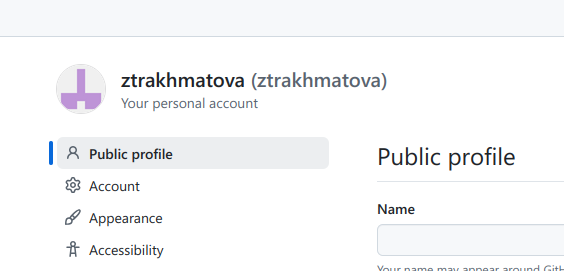{#fig:001 width=70%}

## Базовая настройка git

Открываем терминал и делаем предварительную конфигурацию git(рис. [-@fig:002]).

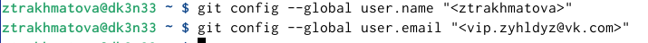{#fig:002 width=70%}

Настроим utf-8 в выводе сообщений git (рис. [-@fig:003])

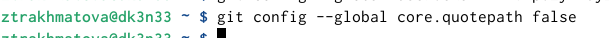{#fig:003 width=70%}

Зададим имя для начальной ветки(рис. [-@fig:004])

{#fig:004 width=70%}

Применение параметров autocrlf и safecrlf(рис. [-@fig:005])

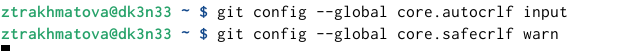{#fig:005 width=70%}

## Создание SSH ключа

Для последующей идентификации пользователя необходимо сгенерировать пару ключей(рис. [-@fig:006])

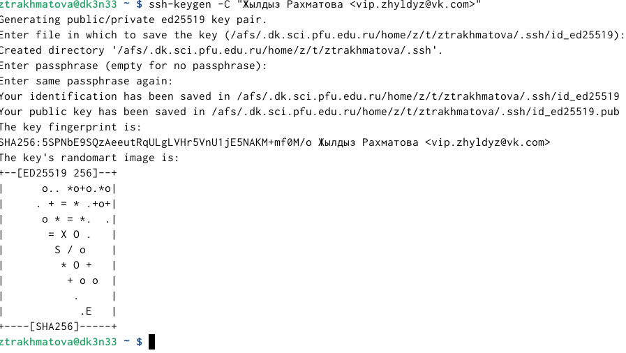{#fig:006 width=70%}

Далее нужно добавить ключ (рис. [-@fig:007])

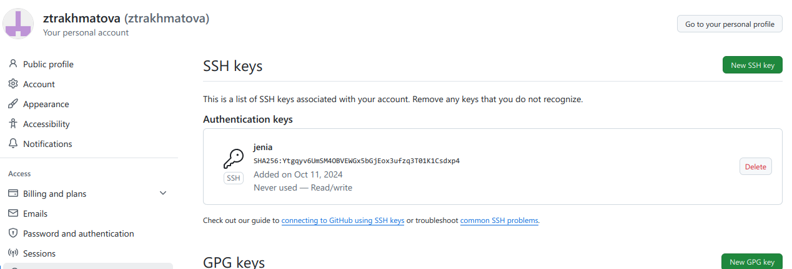{#fig:007 width=70%}

## Сознание рабочего пространства и репозитория курса на основе шаблона

Создаем каталог «архитектура компьютера» (рис. [-@fig:008])

{#fig:008 width=70%}

## Сознание репозитория курса на основе шаблона

Далее создадим репозиторий курса(рис. [-@fig:009])

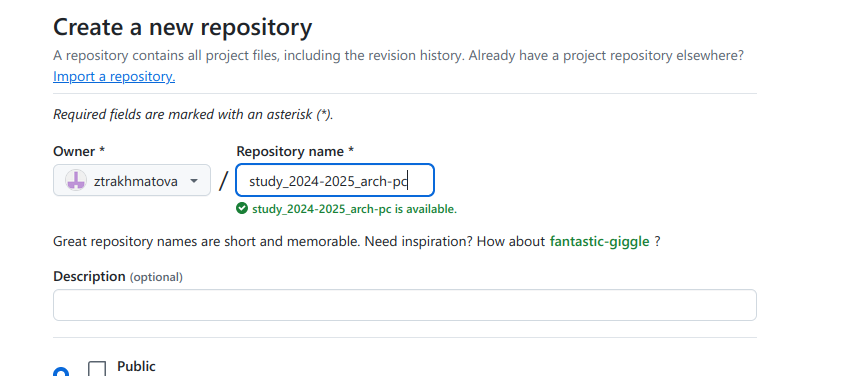{#fig:009 width=70%}

Переходим в каталог курса и копируем репозиторий(рис. [-@fig:0010])

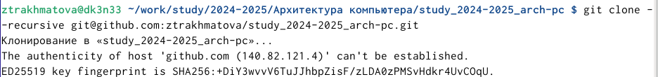{#fig:0010 width=70%}

(рис. [-@fig:0011])
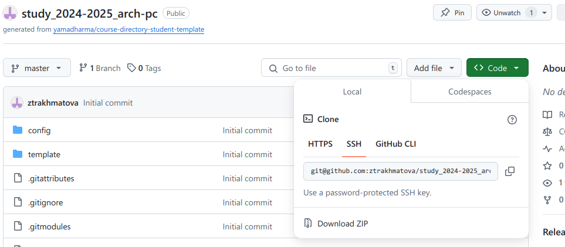{#fig:0011 width=70%}

## Настройка каталога курса

Далее переходим в каталог и удаляем лишние файлы(рис. [-@fig:0012])

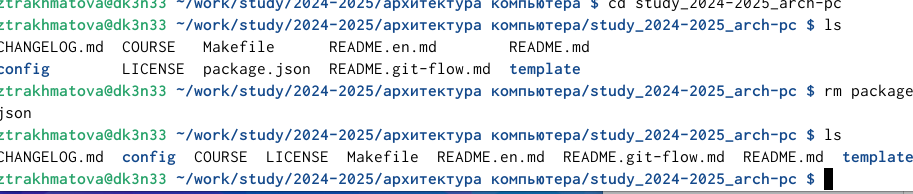{#fig:0012 width=70%}

Создадим необходимые каталоги и отправим на сервер(рис. [-@fig:0013])
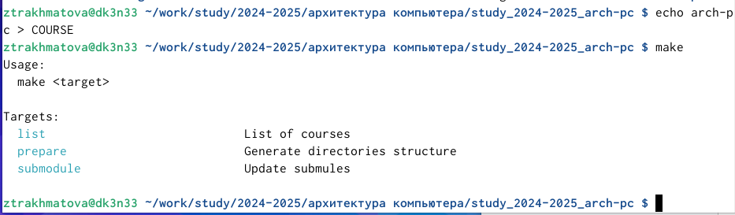{#fig:0013 width=70%}

# Выводы

Выполнив данную лабораторную работу я обрела теоретические и практические знания в использовании Linux и github. При помощи консоли я научилась проводить стандартные процедуры при наличии центрального репозитория, настраивать github, создания SSH ключа, сохранение и отправка изменений на локальном репозитории.

