---
## Front matter
title: "Отчет по лабораторной работе №7"
subtitle: "Дисциплина: архитектура компьютера"
author: "Рахматова Жылдыз Талантбековна"

## Generic otions
lang: ru-RU
toc-title: "Содержание"

## Bibliography
bibliography: bib/cite.bib
csl: pandoc/csl/gost-r-7-0-5-2008-numeric.csl

## Pdf output format
toc: true # Table of contents
toc-depth: 2
lof: true # List of figures
lot: true # List of tables
fontsize: 12pt
linestretch: 1.5
papersize: a4
documentclass: scrreprt
## I18n polyglossia
polyglossia-lang:
  name: russian
  options:
	- spelling=modern
	- babelshorthands=true
polyglossia-otherlangs:
  name: english
## I18n babel
babel-lang: russian
babel-otherlangs: english
## Fonts
mainfont: IBM Plex Serif
romanfont: IBM Plex Serif
sansfont: IBM Plex Sans
monofont: IBM Plex Mono
mathfont: STIX Two Math
mainfontoptions: Ligatures=Common,Ligatures=TeX,Scale=0.94
romanfontoptions: Ligatures=Common,Ligatures=TeX,Scale=0.94
sansfontoptions: Ligatures=Common,Ligatures=TeX,Scale=MatchLowercase,Scale=0.94
monofontoptions: Scale=MatchLowercase,Scale=0.94,FakeStretch=0.9
mathfontoptions:
## Biblatex
biblatex: true
biblio-style: "gost-numeric"
biblatexoptions:
  - parentracker=true
  - backend=biber
  - hyperref=auto
  - language=auto
  - autolang=other*
  - citestyle=gost-numeric
## Pandoc-crossref LaTeX customization
figureTitle: "Рис."
tableTitle: "Таблица"
listingTitle: "Листинг"
lofTitle: "Список иллюстраций"
lotTitle: "Список таблиц"
lolTitle: "Листинги"
## Misc options
indent: true
header-includes:
  - \usepackage{indentfirst}
  - \usepackage{float} # keep figures where there are in the text
  - \floatplacement{figure}{H} # keep figures where there are in the text
---

# Цель работы

Изучение команд условного и безусловного переходов. Приобретение навыков написания программ с использованием переходов. Знакомство с назначением и структурой файла листинга.

# Выполнение лабораторной работы

1) Я создала каталог lab7 и внутри создал файл lab7-1.asm

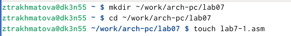{ #fig:001 width=70% }

2) Я ввела в файл текст программы и запустила его.

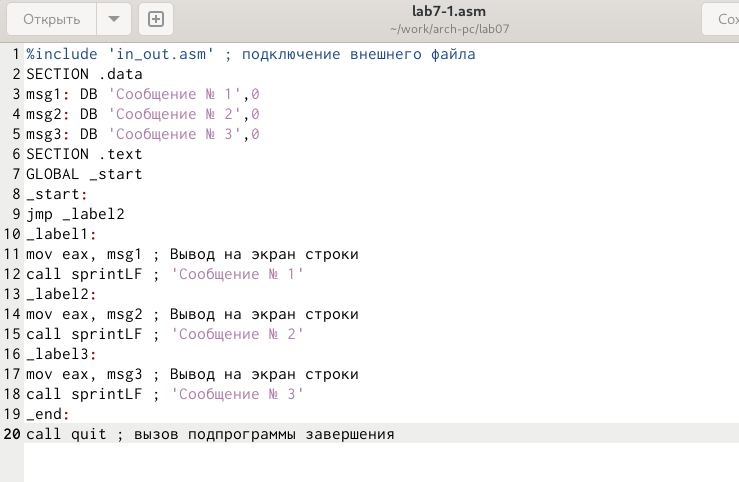{ #fig:002 width=70% }

3) Я создала исполняемый файл и запустила его. Результат соответствовал нужному.

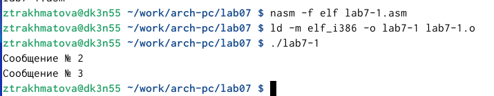{ #fig:003 width=70% }

4)Я изменила текст программы чтобы выводился нужный ответ и создала исполняемый файл.

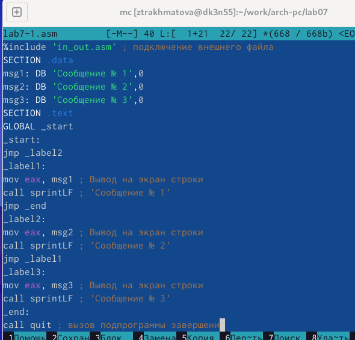{ #fig:004 width=70% }

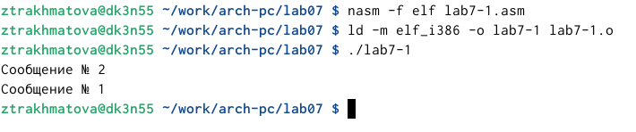{ #fig:005 width=70% }

5)Я изменила текст программы чтобы сначала выводило сообщение 3,затем 2, затем 1.

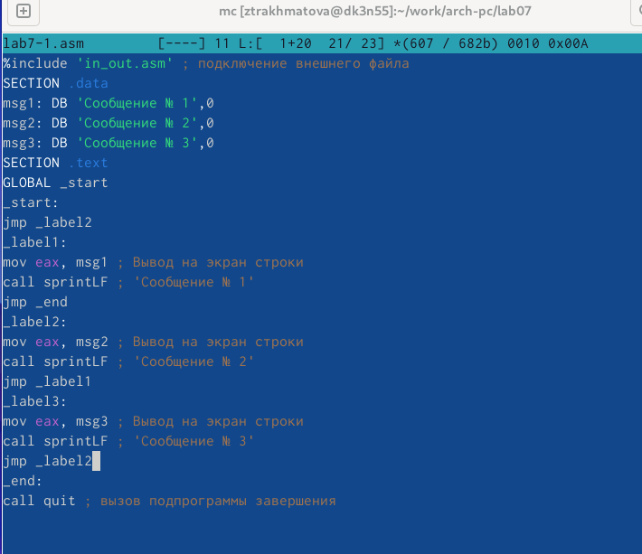{ #fig:006 width=70% }

6) Запустила программу и проверила ее работу.

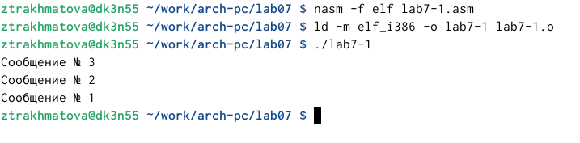{ #fig:007 width=70% }

7) Я создала файл lab7-2.asm и написала текст программы.

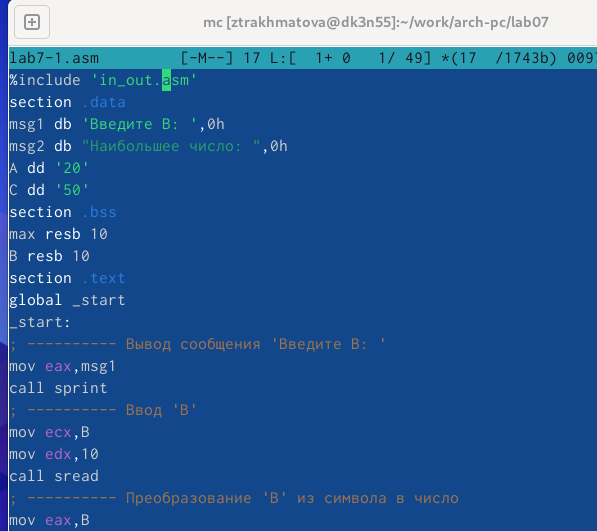{ #fig:008 width=70% }

8) Я ввела два разных числа чтобы проверить как работает программа. 

{ #fig:09 width=70% }

9) Я создала файл листинга lab7-2.lst и открыла его.

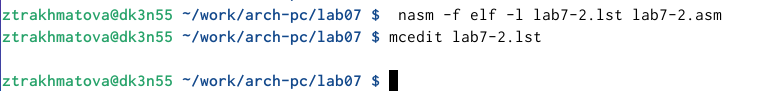{ #fig:010 width=70% }

10) Проанализировав файл, я поняла как он работает и какие значения выводит.

1) Эта строка находится на 24 месте, ее адрес "00000101", Машинный код - В8 [0A000000], а mov eax,B - исходный текст программы, означающий что в регистр eax мы вносим значения переменной B.

{ #fig:011 width=70% }

2) Эта строка находится на 38 месте, ее адрес "00000134", Машинный код - E863FFFFFF, а call atoi - исходный текст программы, означающий что символ лежащий в строке выше переводится в число.

{ #fig:012 width=70% }

3) Эта строка находится на 50 месте, ее адрес "00000162", Машинный код - A1[00000000], а mov eax,[max] - исходный текст программы, означающий что число хранившееся в переменной max записывается в регистр eax.

{ #fig:013 width=70% }

11) В строке mov eax,max я убрала max и попробовал создать файл. Выдало ошибку, так как для программы нужно два операнда.

12) В файле листинга показывает где именно ошибка и с чем она связана.

{ #fig:015 width=70% }

# Самостоятельная работа.

1) Я написала программу для нахождения меньшего из трех чисел. Для большего удобства я сделала ввод чисел с клавиатуры.У меня первый вариант поэтому числа были :17,23,45. Программа вывела меньшее из этих чисел.

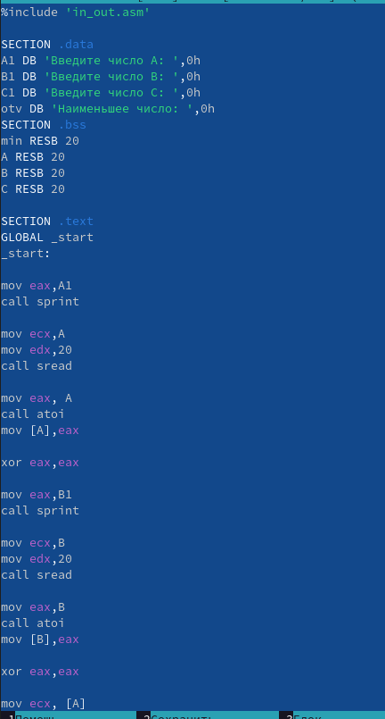{ #fig:016 width=70% }

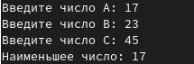{ #fig:017 width=70% }

2) Я написала программу, чтобы она вычисляла выражение при введенных Х и А. Для большего удобства, выражение которое будет вычисляться я вывожу вначале работы программы. Так как у меня 1 вариант, то программа написана для 1 варианта.

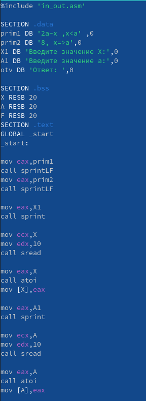{ #fig:018 width=70% }

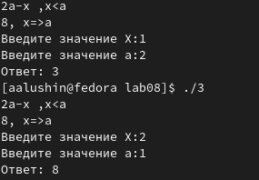{ #fig:019 width=70% }

# Вывод

Я изучила команды условного и безусловного перехода. Приобрел навыки написания программ с переходами.

