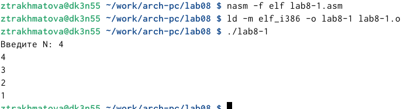

---
## Front matter
title: "Отчет по лабораторной работе №8"
subtitle: "Дисциплина: архитектура компьютера"
author: "Рахматова Жылдыз Талантбековна"

## Generic otions
lang: ru-RU
toc-title: "Содержание"

## Bibliography
bibliography: bib/cite.bib
csl: pandoc/csl/gost-r-7-0-5-2008-numeric.csl

## Pdf output format
toc: true # Table of contents
toc-depth: 2
lof: true # List of figures
lot: true # List of tables
fontsize: 12pt
linestretch: 1.5
papersize: a4
documentclass: scrreprt
## I18n polyglossia
polyglossia-lang:
  name: russian
  options:
	- spelling=modern
	- babelshorthands=true
polyglossia-otherlangs:
  name: english
## I18n babel
babel-lang: russian
babel-otherlangs: english
## Fonts
mainfont: IBM Plex Serif
romanfont: IBM Plex Serif
sansfont: IBM Plex Sans
monofont: IBM Plex Mono
mathfont: STIX Two Math
mainfontoptions: Ligatures=Common,Ligatures=TeX,Scale=0.94
romanfontoptions: Ligatures=Common,Ligatures=TeX,Scale=0.94
sansfontoptions: Ligatures=Common,Ligatures=TeX,Scale=MatchLowercase,Scale=0.94
monofontoptions: Scale=MatchLowercase,Scale=0.94,FakeStretch=0.9
mathfontoptions:
## Biblatex
biblatex: true
biblio-style: "gost-numeric"
biblatexoptions:
  - parentracker=true
  - backend=biber
  - hyperref=auto
  - language=auto
  - autolang=other*
  - citestyle=gost-numeric
## Pandoc-crossref LaTeX customization
figureTitle: "Рис."
tableTitle: "Таблица"
listingTitle: "Листинг"
lofTitle: "Список иллюстраций"
lotTitle: "Список таблиц"
lolTitle: "Листинги"
## Misc options
indent: true
header-includes:
  - \usepackage{indentfirst}
  - \usepackage{float} # keep figures where there are in the text
  - \floatplacement{figure}{H} # keep figures where there are in the text
---

# Цель работы

Приобретение навыков написания программ с использованием циклов и
обработкой аргументов командной строки.

# Выполнение лабораторной работы

1) Я создала каталог lab08 и файл lab8-1.asm

{ #fig:001 width=70% }

2) В файл я ввела текст первой программы и создала исполняемый файл.

{ #fig:002 width=70% }

{ #fig:003 width=70% }

3)Я изменила текст программы, в теле цикла label добавила строку sub eax,1. Циклы закольцевался и стал бесконечным.

{ #fig:004 width=70% }

{ #fig:005 width=70% }

4)  Я изменила текст программы так, чтобы цикл и счетчик работал правильно. По итогу после изменения программы, яисло проходки циклов стал соответствовать числу введенному с клавиатуры.

{ #fig:006 width=70% }

{ #fig:007 width=70% }

5)Я создала файл lab8-2.asm и ввела туда программу, которая выводит все аргумент,которые ввели. Программа выводит все 3 аргумента которые ввели, но в разной вариации.

{ #fig:008 width=70% }

{ #fig:009 width=70% }

6) Я создала фалй lab8-3.asm. Ввела текст программы и запустила ее. Программа вывела сумму чисел, которые я ввела.

{ #fig:010 width=70% }

{ #fig:011 width=70% }

7) Я изменила программу, чтобы она выводила произведение введенных чисел.

{ #fig:012 width=70% }

{ #fig:013 width=70% }

# Самостотельная работа

Я написала программу, которая выводит сумму всех решений примера. В лабораторной работе №6, я получила 8 вариант, поэтому я писала программу для восьмого варианта. Введенные числа я придумала сама, и посчитала их, чтобы проверить работу программы.

{ #fig:014 width=70% }

{ #fig:015 width=70% }

# Вывод{.unnumbered}

Я приобрела навыки написания программы с использованием цикла.

